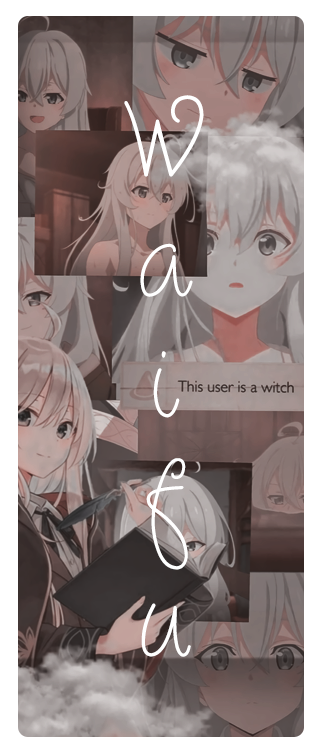

 

 
 
  
- Name **BaoBao Junior**

- Live in **Viet Nam**

- Studying ...

- Good with **Javascript** , **Typescript** , **PHP** , **Bash** , **CSS** , **HTML** and **Python**

- Have high experience with **Photoshop** and **CorelDRAW**
  

- Understand English (Fluent)

 

 
 
  
- 📗   
  
- 📘   
  
- 📙  
 
- 📒  
  

 
 
  
 *“People with evil intent can do evil things without lying. And not all liars are evil.†– Elaina* 
<!--

-->

